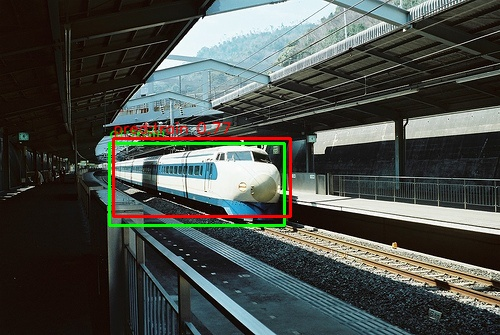
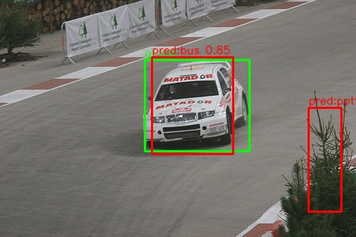
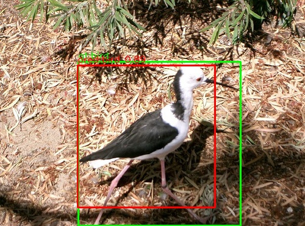

# yolov1 pytorch

#### Demo




#### Evaluation
VOC2007 11-point AP，IoU=0.5，score threshold=0.0。

```
mAP@0.50: 0.5380
aeroplane    0.6595
bicycle      0.5156
bird         0.6002
boat         0.3905
bottle       0.2867
bus          0.6103
car          0.5982
cat          0.7931
chair        0.2995
cow          0.5779
diningtable  0.4268
dog          0.7675
horse        0.5838
motorbike    0.5999
person       0.5330
pottedplant  0.2720
sheep        0.5814
sofa         0.4644
train        0.6977
tvmonitor    0.5018