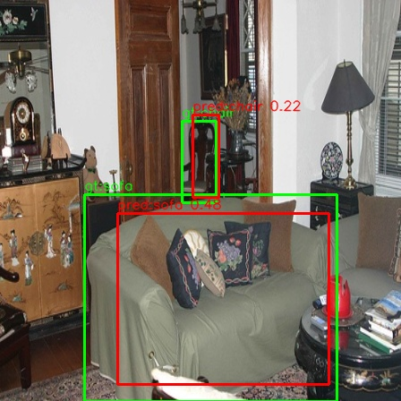
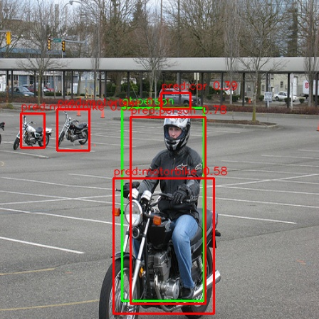
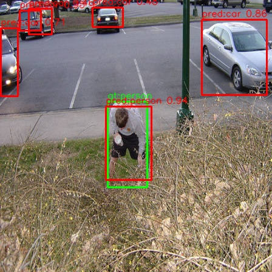

# yolov1 pytorch

#### Demo





#### Evaluation
VOC2007 11-point AP，IoU=0.5，score threshold=0.0。

```
Using device: cuda
mAP@0.50: 0.5189
aeroplane    0.6923
bicycle      0.4206
bird         0.6135
boat         0.3599
bottle       0.2766
bus          0.6141
car          0.4976
cat          0.7613
chair        0.2664
cow          0.6224
diningtable  0.3972
dog          0.7482
horse        0.5619
motorbike    0.5652
person       0.5509
pottedplant  0.2841
sheep        0.5669
sofa         0.3936
train        0.6997
tvmonitor    0.4850